# Static analysis of Java application dependencies


If you are a developer, you may know what is [OWASP (Open Web Application Security Project) Top 10](https://owasp.org/www-project-top-ten/). It is the Top 10 list of the most critical security risks to web applications. It is periodically review. The latest version is the OWASP Top 10 2017.

For example, Injection is the A1 in OWASP Top 10 2017. The website details the risk, how the attacker can proceed, what are the risks and how to prevent.

In this article, we explain in few words the idea behind the issue A9–2017 in the OWASP Top 10 2017. Then, we will integrate a solution in CI pipeline with Gitlab CI. And, how to integrate the reports in user interfaces.

Code source are available [here](https://github.com/Treeptik/Static-analysis-of-Java-application-dependencies).

## A9: 2017 - Using Components with Known Vulnerabilities

All the details of the issue are available on the [official website](https://owasp.org/www-project-top-ten/2017/A9_2017-Using_Components_with_Known_Vulnerabilities). To sum up, let us consider your code is well-written, without any bug or vulnerability. But to be executed, your code has dependencies: the OS (Operating System) of the server, the web server, other various applications, libraries, etc. Your code is not the only possible security breach.

Security is one of the most important subjects. People who are using your services must be safe on your application. We must know what components of our application are vulnerable and if there are solution to avoid this.

Of course, there are various strategies and best practices:

- **Reduce the surface of attacks**. Well-known in network, as for us it can be translated by removing unused dependencies and dead code.
- **Use official sources over secure links and** check if the dependencies are **maintained**.
- **Continuously monitor** sources of our dependencies. To be able to do this, you need to know the version of all the dependencies. Fortunately, it can be automatized and embed in our CI (continuous integration) pipeline. It is simplified by using dependency management tools with your language (Maven/Gradle for Java, Composer with PHP, NPM/Yarn with JavaScript, etc.)

Next, we present [OWASP dependency check](https://owasp.org/www-project-dependency-check/) to scan our application and find vulnerable libraries.

## OWASP dependency check

[OWASP dependency check](https://owasp.org/www-project-dependency-check/) is a tool advice by the OWASP project. It is a trusted source. Then, if we look at the [GitHub repository](https://github.com/jeremylong/DependencyCheck), the project is always active. So, according to our previous section, we can use it.

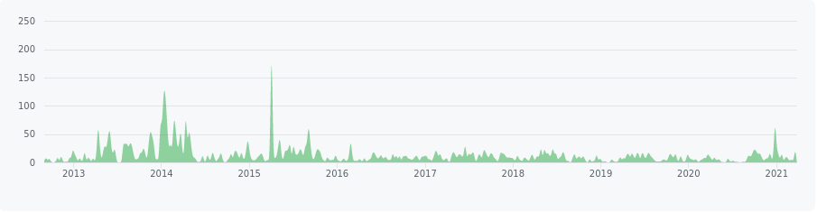

### Example: A Java Spring Boot application

In our example, we are using a Java application. So, we choose to use the Maven plugin. Our Java application will do nothing, it is just an example to analyse the dependencies.

We can generate a project from [Spring Initializr](https://start.spring.io/).

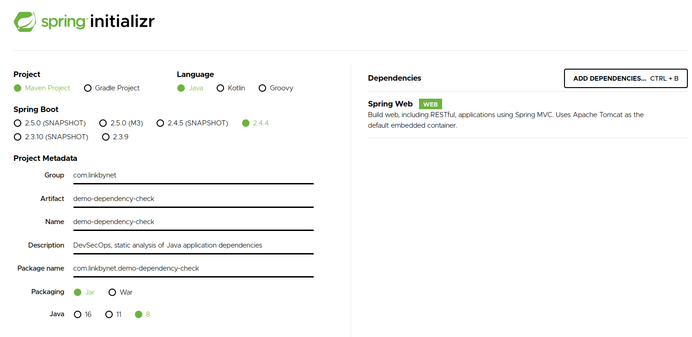

And we get the description file of the dependencies.

```xml
<?xml version="1.0" encoding="UTF-8"?>
<project xmlns="http://maven.apache.org/POM/4.0.0" xmlns:xsi="http://www.w3.org/2001/XMLSchema-instance" xsi:schemaLocation="http://maven.apache.org/POM/4.0.0 https://maven.apache.org/xsd/maven-4.0.0.xsd">
    <modelVersion>4.0.0</modelVersion>

    <parent>
        <groupId>org.springframework.boot</groupId>
        <artifactId>spring-boot-starter-parent</artifactId>
        <version>2.4.4</version>
        <relativePath /> <!-- lookup parent from repository -->
    </parent>

    <groupId>com.linkbynet</groupId>
    <artifactId>demo-dependency-check</artifactId>
    <version>0.0.1-SNAPSHOT</version>
    <name>demo-dependency-check</name>
    <description>DevSecOps, static analysis of Java application dependencies<   description>
    <properties>
        <java.version>1.8</java.version>
    </properties>

    <dependencies>
        <dependency>
            <groupId>org.springframework.boot</groupId>
            <artifactId>spring-boot-starter-web</artifactId>
        </dependency>
        <dependency>
            <groupId>org.springframework.boot</groupId>
            <artifactId>spring-boot-starter-test</artifactId>
            <scope>test</scope>
        </dependency>
    </dependencies>

    <build>
        <plugins>
            <plugin>
                <groupId>org.springframework.boot</groupId>
                <artifactId>spring-boot-maven-plugin</artifactId>
            </plugin>
        </plugins>
    </build>
</project>
```

From this file, we add the OWASP dependency check plugin and downgrade the Spring boot version to 2.0.0 to put forward the usefulness of the plugin and reveal vulnerabilities.

We add, in the configuration the export of the report in HTML to have a quick look of the report; and XML to export the report in SonarQube for example.

```xml
<?xml version="1.0" encoding="UTF-8"?>
<project xmlns="http://maven.apache.org/POM/4.0.0" xmlns:xsi="http://www.w3.org/2001/XMLSchema-instance" xsi:schemaLocation="http://maven.apache.org/POM/4.0.0 https://maven.apache.org/xsd/maven-4.0.0.xsd">
    <modelVersion>4.0.0</modelVersion>

    <parent>
        <groupId>org.springframework.boot</groupId>
        <artifactId>spring-boot-starter-parent</artifactId>
        <version>2.0.0.RELEASE</version>
        <relativePath />
    </parent>

    <groupId>com.linkbynet</groupId>
    <artifactId>demo-dependency-check</artifactId>
    <version>0.0.1-SNAPSHOT</version>
    <name>demo-dependency-check</name>
    <description>DevSecOps, static analysis of Java application dependencies</description>
    <properties>
        <java.version>1.8</java.version>
        <dependency-check.version>6.1.3</dependency-check.version>
    </properties>

    <dependencies>
        <dependency>
            <groupId>org.springframework.boot</groupId>
            <artifactId>spring-boot-starter-web</artifactId>
        </dependency>
        <dependency>
            <groupId>org.springframework.boot</groupId>
            <artifactId>spring-boot-starter-test</artifactId>
            <scope>test</scope>
        </dependency>
    </dependencies>

    <build>
        <pluginManagement>
            <plugins>
                <plugin>
                    <groupId>org.owasp</groupId>
                    <artifactId>dependency-check-maven</artifactId>
                    <version>${dependency-check.version}</version>
                </plugin>
            </plugins>
        </pluginManagement>

        <plugins>
            <plugin>
                <groupId>org.springframework.boot</groupId>
                <artifactId>spring-boot-maven-plugin</artifactId>
            </plugin>
            <plugin>
                <groupId>org.owasp</groupId>
                <artifactId>dependency-check-maven</artifactId>
                <version>${dependency-check.version}</version>
                <configuration>
                    <formats>XML,HTML</formats>
                    <failOnError>false</failOnError>
                </configuration>
                <executions>
                    <execution>
                        <goals>
                            <goal>check</goal>
                        </goals>
                    </execution>
                </executions>
            </plugin>
        </plugins>
    </build>

    <reporting>
        <plugins>
            <plugin>
                <groupId>org.owasp</groupId>
                <artifactId>dependency-check-maven</artifactId>
                <version>${dependency-check.version}</version>
            </plugin>
        </plugins>
    </reporting>
</project>
```

Then, let us build the application with Maven, using the Maven wrapper

```bash
./mvnw clean verify
```

On the target directory, we can find dependency check report files.

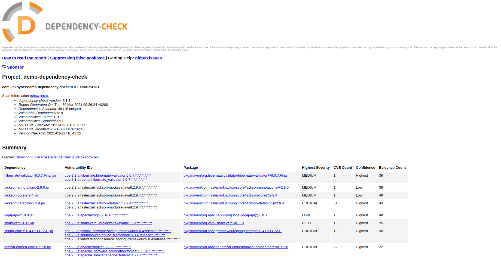

We can see a summary of the vulnerabilities found. And, by clicking on a dependency, we can read the detail of the vulnerabilities.

For example, on the next image, for spring core, there are details of CVE and the version where the breach is corrected.


## SonarQube integration

In an [earlier article](https://medium.com/linkbynet/code-quality-testing-with-sonarqube-and-gitlab-ci-for-php-applications-f0c953f4133d), we saw how to integrate reports from PHPUnit in SonarQube. Here, for Java applications, we can also use sonar-scanner.

Most of the time, Java developer prefers using plugins with maven. Maven is powerful and considering it as a CI/CD tool is not wrong. It is useless to multiply the number of tools, mostly in that case Maven is a suitable candidate.

### SonarQube with Maven

For Java developer this method can be obvious, but if you are curious, you can see [another method](https://medium.com/linkbynet/code-quality-testing-with-sonarqube-and-gitlab-ci-for-php-applications-f0c953f4133d). You can jump to the next sub section "SonarQube plugin"

Once you have created the project in SonarQube, you just must run this command line.

```bash
./mvnw sonar:sonar \
    -Dsonar.projectKey=demo-java-dependency-check \
    -Dsonar.host.url=http://10.1.1.1:9000 \
    -Dsonar.login=feece463fd9cceae20ee2e7b44189b6367bea49d
```

For some improvements, in the other language we can create a sonar-project.properties file. But Maven ignore this file, we must embed the sonar properties in the `pom.xml` file.

To make as clean as we can for this demonstration, we register these in a profile active by default. We do not take too much time on the management of properties and credentials for Maven.

```xml
<?xml version="1.0" encoding="UTF-8"?>
<project xmlns="http://maven.apache.org/POM/4.0.0" xmlns:xsi="http://www.w3.org/2001/XMLSchema-instance" xsi:schemaLocation="http://maven.apache.org/POM/4.0.0 https://maven.apache.org/xsd/maven-4.0.0.xsd">
    <modelVersion>4.0.0</modelVersion>

    <parent>
        <groupId>org.springframework.boot</groupId>
        <artifactId>spring-boot-starter-parent</artifactId>
        <version>2.0.0.RELEASE</version>
        <relativePath />
    </parent>

    <groupId>com.linkbynet</groupId>
    <artifactId>demo-dependency-check</artifactId>
    <version>0.0.1-SNAPSHOT</version>
    <name>demo-dependency-check</name>
    <description>DevSecOps, static analysis of Java application dependencies</description>
    <properties>
        <java.version>1.8</java.version>
        <dependency-check.version>6.1.3</dependency-check.version>
    </properties>

    <dependencies>
        <dependency>
            <groupId>org.springframework.boot</groupId>
            <artifactId>spring-boot-starter-web</artifactId>
        </dependency>
        <dependency>
            <groupId>org.springframework.boot</groupId>
            <artifactId>spring-boot-starter-test</artifactId>
            <scope>test</scope>
        </dependency>
    </dependencies>

    <build>
        <pluginManagement>
            <plugins>
                <plugin>
                    <groupId>org.owasp</groupId>
                    <artifactId>dependency-check-maven</artifactId>
                    <version>${dependency-check.version}</version>
                </plugin>
            </plugins>
        </pluginManagement>

        <plugins>
            <plugin>
                <groupId>org.springframework.boot</groupId>
                <artifactId>spring-boot-maven-plugin</artifactId>
            </plugin>
            <plugin>
                <groupId>org.owasp</groupId>
                <artifactId>dependency-check-maven</artifactId>
                <version>${dependency-check.version}</version>
                <configuration>
                    <formats>XML,HTML</formats>
                    <failOnError>false</failOnError>
                </configuration>
                <executions>
                    <execution>
                        <goals>
                            <goal>check</goal>
                        </goals>
                    </execution>
                </executions>
            </plugin>
        </plugins>
    </build>

    <reporting>
        <plugins>
            <plugin>
                <groupId>org.owasp</groupId>
                <artifactId>dependency-check-maven</artifactId>
                <version>${dependency-check.version}</version>
            </plugin>
        </plugins>
    </reporting>

    <profiles>
        <profile>
            <id>sonar</id>
            <activation>
                <activeByDefault>true</activeByDefault>
            </activation>
            <properties>
                <sonar.host.url>http://10.1.1.1:9000</sonar.host.url>
                <sonar.projectKey>demo-java-dependency-check</sonar.projectKey>
                <sonar.login>feece463fd9cceae20ee2e7b44189b6367bea49d</sonar.login>
                <sonar.dependencyCheck.xmlReportPath>target/dependency-check-report.xml</sonar.dependencyCheck.xmlReportPath>

                <sonar.java.libraries.empty>true</sonar.java.libraries.empty>
                <sonar.exclusions>pom.xml</sonar.exclusions>
            </properties>
        </profile>
    </profiles>
</project>
```

The command line becomes:

```bash
./mvnw sonar:sonar
```

### SonarQube plugin

After these few remarks, the goal is to embed the dependency check report in SonarQube.

First, we install a plugin in SonarQube. In **Administration menu > Market Place**, we search **Dependency Check** plugin. Let us install and reboot SonarQube.

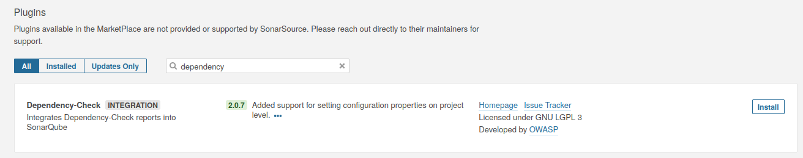

Sonar is ready, Maven is configured. After the execution of Maven, for the same example, this is the result in SonarQube.

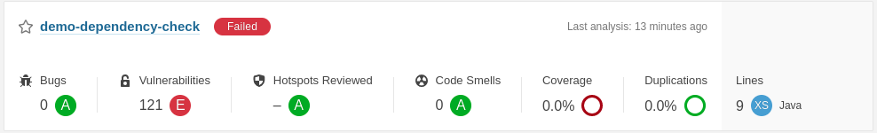

Let us focus on Vulnerabilities, the other measures are not relevant for the demonstration.

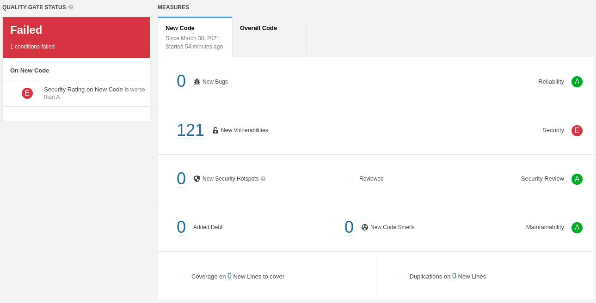

Also, in an [earlier article](https://medium.com/linkbynet/code-quality-testing-with-sonarqube-and-gitlab-ci-for-php-applications-f0c953f4133d), we saw how to fail a pipeline if some quality criteria are not satisfied. The criterion to select in that case is the Security Rating.

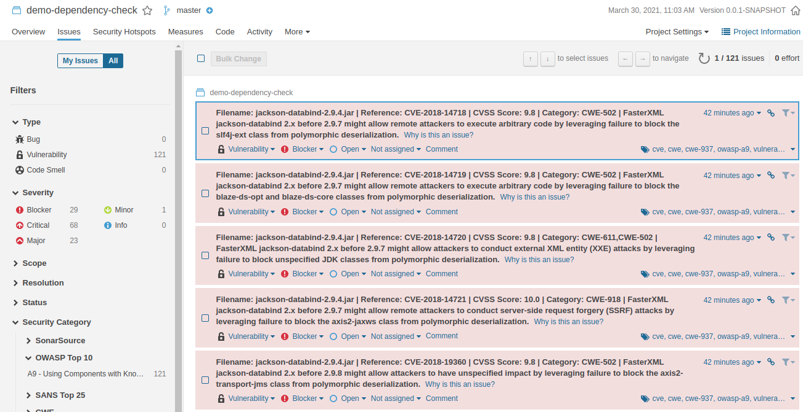

By clicking on the number of vulnerabilities, we have the list of all vulnerability details. As, we can see, they can be classified as severity. It allows us to measure the emergency and the priorities.

## CI/CD integration

### Gitlab CI

[Dependency scanning](https://docs.gitlab.com/ee/user/application_security/dependency_scanning/) integration feature in Gitlab CI interface is available in the [Ultimate](https://about.gitlab.com/pricing/) version only.

One possible solution might generate the HTML report as an artifact. But the integration is not very well.

```yaml
stages:
  - build

maven:
  stage: build
  image:
    name: maven:3.6-openjdk-8
  variables:
    MAVEN_OPTS: "-Dmaven.repo.local=$CI_PROJECT_DIR/.m2/repository"
  script:
    - mvn clean install -DskipTests
  cache:
    key: ${CI_JOB_NAME}
    paths:
      - .m2/repository
  artifacts:
    paths:
      - target/dependency-check-report.html
    expire_in: 30 min
```

### Jenkins

Jenkins is the most famous CI/CD tools. It is very customizable thanks to these plugins. By default, I always install default Jenkins plugins. And for this example, we must add the [Docker Pipelines](https://plugins.jenkins.io/docker-workflow/) plugin.

> For those how are familiar with Jenkins and must migrate to Gitlab CI, this plugin can be a first step to understand the logic of Gitlab CI pipelines.

This is the example of a simple Maven build using pipeline as code with Jenkins. We are using the same example as describe before. So, this job will create the dependency check report and export this to the SonarQube instance.

```groovy
pipeline {
    agent {
        docker {
            image 'maven:3.6-openjdk-8'
        }
    }

    triggers {
        pollSCM('*/1 * * * *')
    }

    stages {
        stage ('Maven build') {
            steps {
                sh 'mvn clean install -DskipTests'
            }
        }
    }
}
```

Here, we want to show how to integrate the Dependency Check report into the Jenkins interface.

First, we must install the [OWASP Dependency Check plugin](https://plugins.jenkins.io/dependency-check-jenkins-plugin/). In the menu, click on Manage Jenkins and then Manage Plugins. In the Available tabs, search with keywords "OWASP." And install, [OWASP Dependency Check plugin](https://plugins.jenkins.io/dependency-check-jenkins-plugin/).

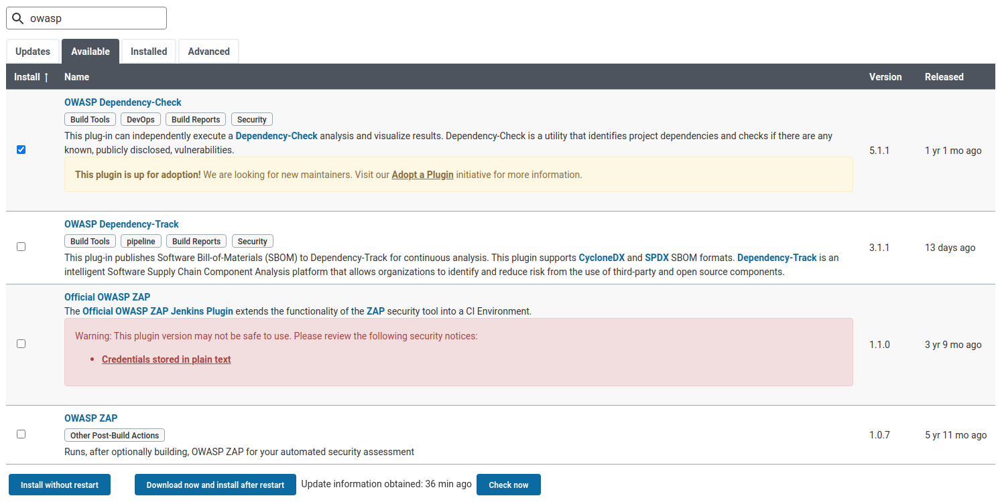

After doing this, we just add the publishing report function to the Jenkinsfile and run the job.

```groovy
pipeline {
    agent {
        docker {
            image 'maven:3.6-openjdk-8'
        }
    }

    triggers {
        pollSCM('*/1 * * * *')
    }

    stages {
        stage ('Maven build') {
            steps {
                sh 'mvn clean install -DskipTests'
                dependencyCheckPublisher pattern: 'target/dependency-check-report.xml'
            }
        }
    }
}
```

We will show a graph in the job dashboard standing for the evolution of vulnerabilities on the branch with their various level of criticality.

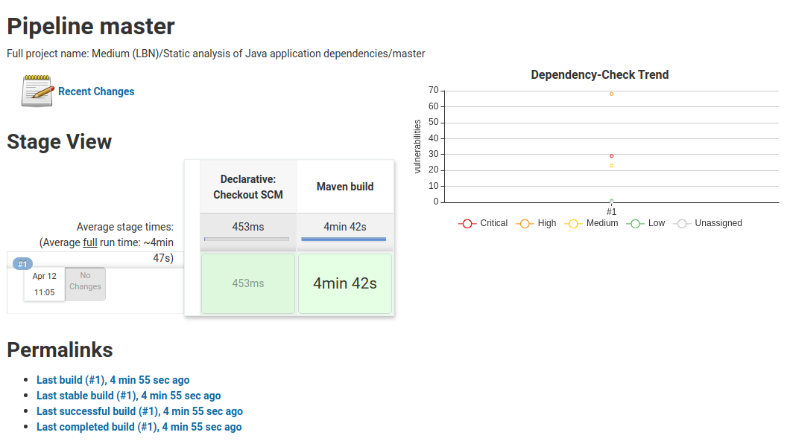

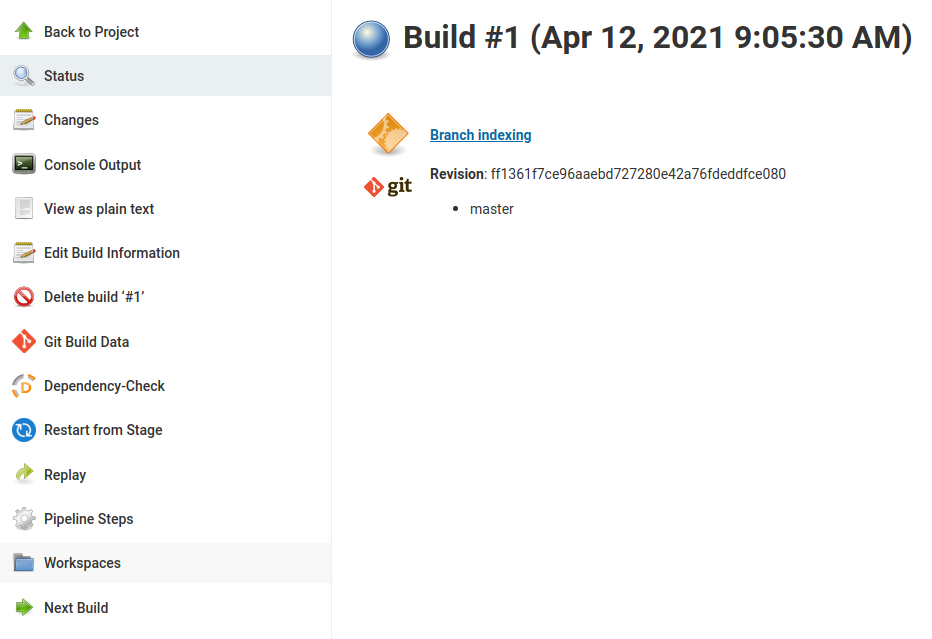

In the build screen, we can have access to a Dependency Check item that detail the vulnerabilities.

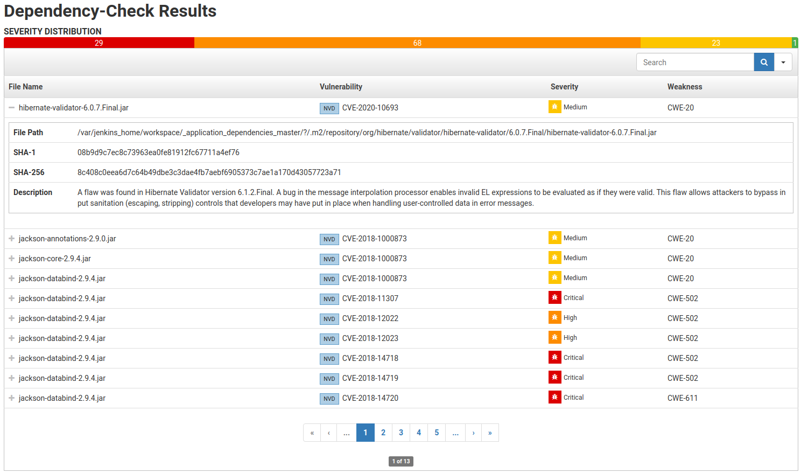

### GitHub actions

I take advantage of authoring this article to mention GitHub actions. To be honest, it is the first time I am looking at GitHub actions. So, this is the opinion of a beginner.

#### First observations

But few days ago, on one of my old repositories, I saw this message.

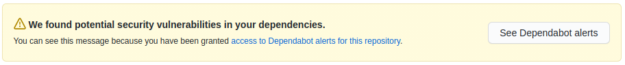

So, let us look at the vulnerabilities.

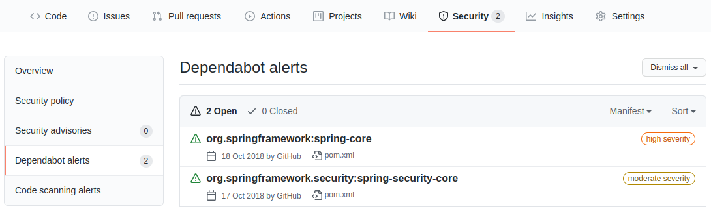

Let us try to apply the solution on our current example.

#### Code scanning

By default, we create a public repository to set up for free. If you must keep the source private, to activate code scanning you will be redirected to contact Sales.

Then, in security tab, we set up code scanning and activate CodeQL Analysis.

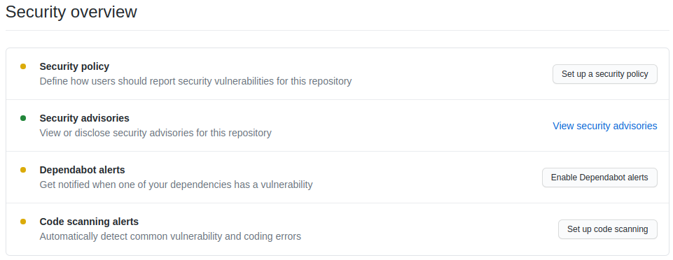

This will create a workflow description file, that you commit in a new branch. For the example, and as the beginner I am, I try with the default file. By comparison with the other project, the file is quite the same. So, I can hope to have some comparable results.

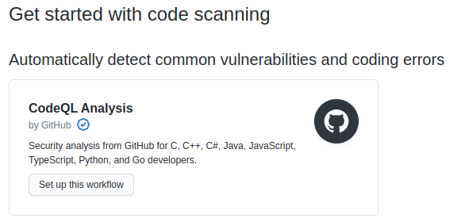

But no vulnerability was found.

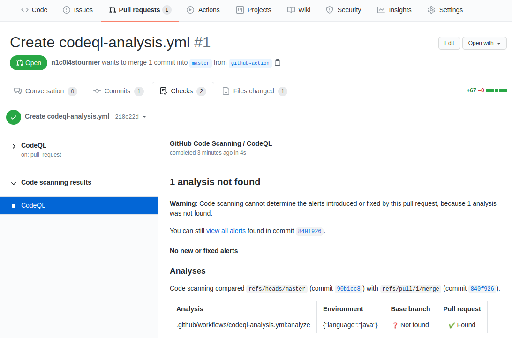

Obviously, this is only an example. To have a better approach of the tool, we need to make some other comparison with other languages. But for the moment, for Java applications, we cannot use CodeQL in GitHub.

Other applications can be used, it will be interesting to test them. Here, the goal was to show how these kinds of results are embedded in GitHub.

### CI Conclusion

If you are using Jenkins, the report can be easily embedded, with some charts that show in a sight the evolution of our dependency analysis. Jenkins can be a solution if the most of your reports are in this tool.

If you are using Gitlab without the Ultimate Edition, you choose another tool such as SonarQube or generate HTML report as artifact, but the integration is not as good as the other features.

## Conclusion

In this article, we saw:

- what is TOP 10  OWASP and dealing with the A9 issue.
- how to use OWASP dependency check for Java applications.
- how to embed reports in Sonar.
- how to integrate the analysis in the CI.

Code source are available [here](https://github.com/Treeptik/Static-analysis-of-Java-application-dependencies).

Thanks for reading.
